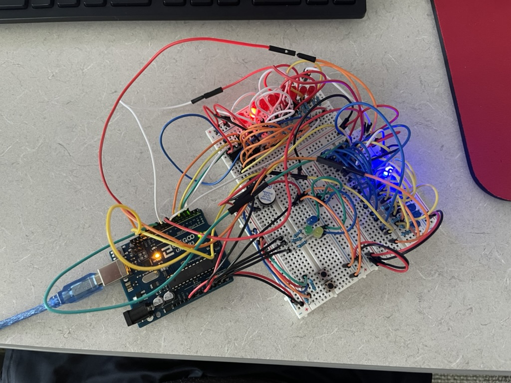

# Counter
Arduino Counter

A clock that starts upon recieving power. Can count seconds, minutes, hours, days, months and years.
Uses red LED lights to count the ones place while the blue lights count the tens place. Can be cycled through each count with a button.

